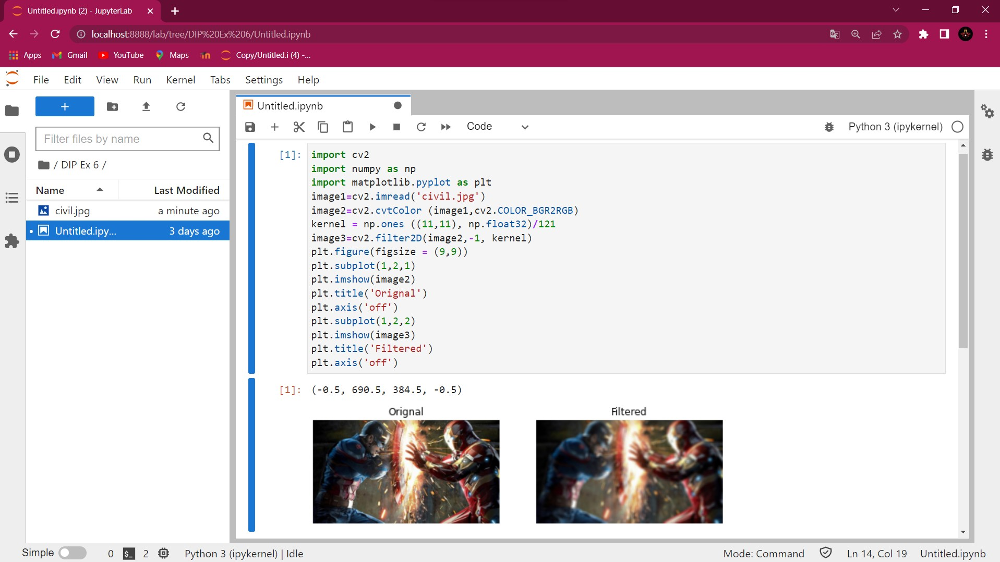
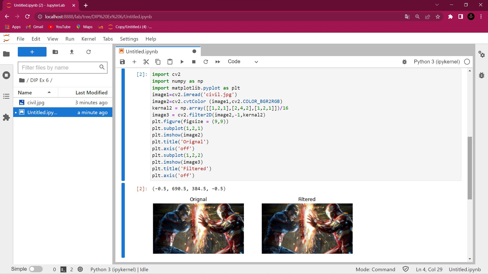
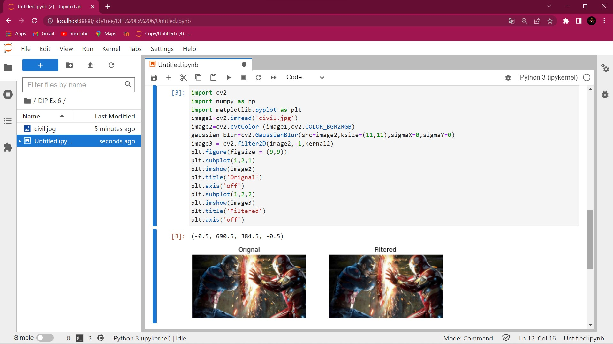
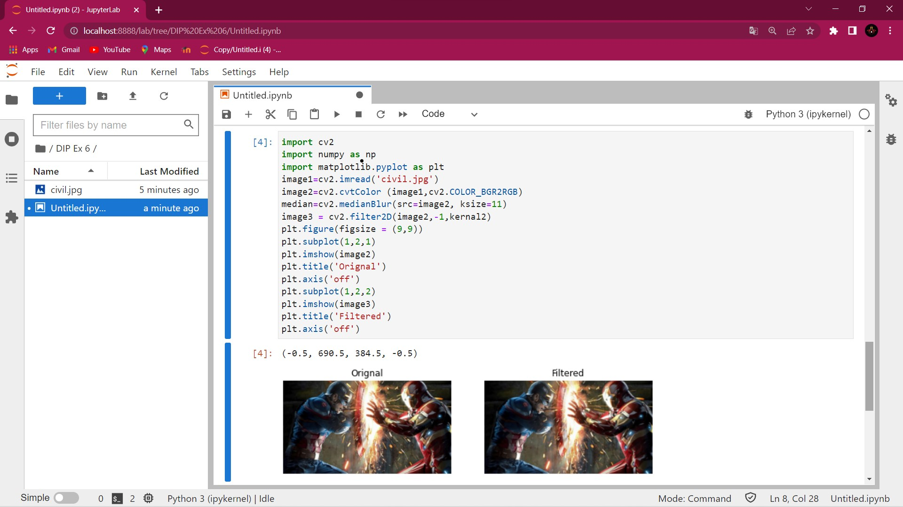
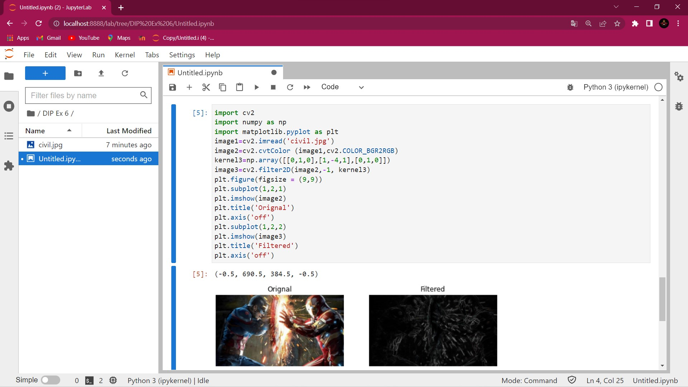
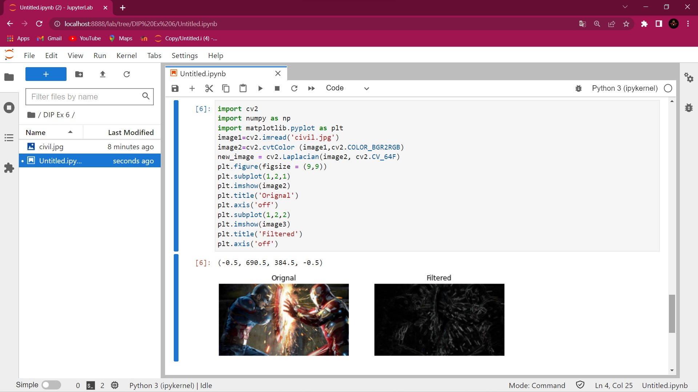

# Implementation-of-Filters
## Aim:
To implement filters for smoothing and sharpening the images in the spatial domain.

## Software Required:
Anaconda - Python 3.7

## Algorithm:
### Step 1:
Import All The Necessary Modules.
<br>

### Step 2:
Using Averaging Filter Smoothen the given image.
<br>

### Step 3:
Using the Weighted Averaging Filter Smoothen the given Image.
<br>

### Step 4:
Using the Gaussian Filter Smoothen the given Image.
<br>

### Step 5:
Using the Median Filter Smoothen the given Image.
<br>

### Step 6:
Using the Laplacian Kernel Filter Sharpen the given Image.
<br>

### Step 7:
Using the Laplacian Operator Filter Sharpen the given Image.


## Program:
```
Developed By   : Yuvadarshini S
Register Number: 212221230126
```
</br>

### 1. Smoothing Filters
i) Using Averaging Filter
```Python
import cv2
import numpy as np
import matplotlib.pyplot as plt
image1=cv2.imread('civil.jpg')
image2=cv2.cvtColor (image1,cv2.COLOR_BGR2RGB) 
kernel = np.ones ((11,11), np.float32)/121
image3=cv2.filter2D(image2,-1, kernel)
plt.figure(figsize = (9,9))
plt.subplot(1,2,1) 
plt.imshow(image2)
plt.title('Orignal') 
plt.axis('off')
plt.subplot(1,2,2)
plt.imshow(image3)
plt.title('Filtered')
plt.axis('off')
```
ii) Using Weighted Averaging Filter
```Python
import cv2
import numpy as np
import matplotlib.pyplot as plt
image1=cv2.imread('civil.jpg')
image2=cv2.cvtColor (image1,cv2.COLOR_BGR2RGB) 
kernal2 = np.array([[1,2,1],[2,4,2],[1,2,1]])/16 
image3 = cv2.filter2D(image2,-1,kernal2)
plt.figure(figsize = (9,9))
plt.subplot(1,2,1) 
plt.imshow(image2)
plt.title('Orignal') 
plt.axis('off')
plt.subplot(1,2,2)
plt.imshow(image3)
plt.title('Filtered')
plt.axis('off')
```
iii) Using Gaussian Filter
```Python
import cv2
import numpy as np
import matplotlib.pyplot as plt
image1=cv2.imread('civil.jpg')
image2=cv2.cvtColor (image1,cv2.COLOR_BGR2RGB) 
gaussian_blur=cv2.GaussianBlur(src=image2,ksize=(11,11),sigmaX=0,sigmaY=0)
image3 = cv2.filter2D(image2,-1,kernal2)
plt.figure(figsize = (9,9))
plt.subplot(1,2,1) 
plt.imshow(image2)
plt.title('Orignal') 
plt.axis('off')
plt.subplot(1,2,2)
plt.imshow(image3)
plt.title('Filtered')
plt.axis('off')
```
iv) Using Median Filter
```Python
import cv2
import numpy as np
import matplotlib.pyplot as plt
image1=cv2.imread('civil.jpg')
image2=cv2.cvtColor (image1,cv2.COLOR_BGR2RGB) 
median=cv2.medianBlur(src=image2, ksize=11)
image3 = cv2.filter2D(image2,-1,kernal2)
plt.figure(figsize = (9,9))
plt.subplot(1,2,1) 
plt.imshow(image2)
plt.title('Orignal') 
plt.axis('off')
plt.subplot(1,2,2)
plt.imshow(image3)
plt.title('Filtered')
plt.axis('off')
```

### 2. Sharpening Filters
i) Using Laplacian Kernel
```Python
import cv2
import numpy as np
import matplotlib.pyplot as plt
image1=cv2.imread('civil.jpg')
image2=cv2.cvtColor (image1,cv2.COLOR_BGR2RGB) 
kernel3=np.array([[0,1,0],[1,-4,1],[0,1,0]])
image3=cv2.filter2D(image2,-1, kernel3)
plt.figure(figsize = (9,9))
plt.subplot(1,2,1) 
plt.imshow(image2)
plt.title('Orignal') 
plt.axis('off')
plt.subplot(1,2,2)
plt.imshow(image3)
plt.title('Filtered')
plt.axis('off')
```
ii) Using Laplacian Operator
```Python
import cv2
import numpy as np
import matplotlib.pyplot as plt
image1=cv2.imread('civil.jpg')
image2=cv2.cvtColor (image1,cv2.COLOR_BGR2RGB) 
new_image = cv2.Laplacian(image2, cv2.CV_64F)
plt.figure(figsize = (9,9))
plt.subplot(1,2,1) 
plt.imshow(image2)
plt.title('Orignal') 
plt.axis('off')
plt.subplot(1,2,2)
plt.imshow(image3)
plt.title('Filtered')
plt.axis('off')
```

## OUTPUT:
### 1. Smoothing Filters
</br>

i) Using Averaging Filter
</br>

</br>

ii) Using Weighted Averaging Filter
</br>

</br>

iii) Using Gaussian Filter
</br>

</br>

iv) Using Median Filter
</br>

</br>

### 2. Sharpening Filters
</br>

i) Using Laplacian Kernel
</br>

</br>

ii) Using Laplacian Operator
</br>

</br>

## Result:
Thus the filters are designed for smoothing and sharpening the images in the spatial domain.